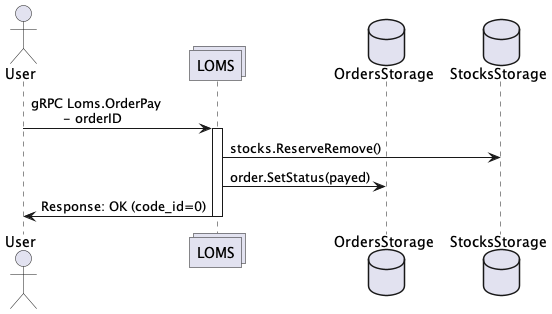
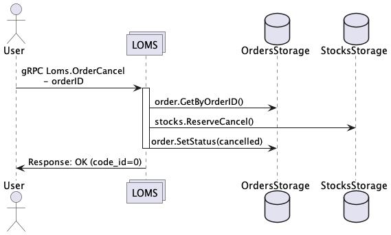
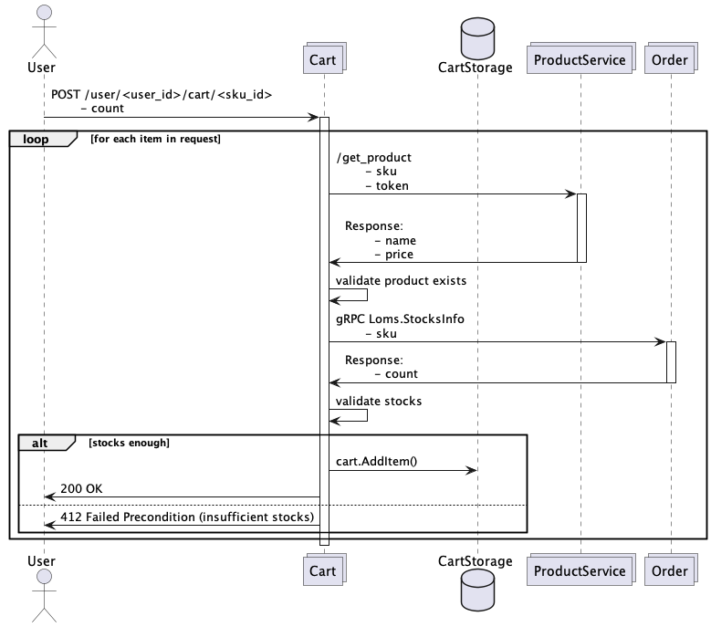

# Домашнее задание по модулю "Деплой приложений и межсервисное взаимодействие"

Добавить сервис LOMS и организовать взаимодействие между cart и loms с использованием gRPC.

## Основное задание

Необходимо:
- Имплементировать сервис, отвечающий за учет заказов и стоки по товарам. Логика работы методов и их контракты описаны ниже.
- Реализовать взаимодействие сервисов cart и loms через gRPC.

Требование к решению:
- Создать protobuf контракт сервиса loms.
- В каждом проекте нужно добавить в Makefile команды для генерации .go файлов из proto файлов и установки нужных зависимостей (используем protoc).
- Состояние храним в in-memory, персистентное хранилище на данный момент не требуется. 2 репозитория - Stock и Order. 
- Код должен быть покрыт тестами (тесты на методы репозитория - не требуются). 
- Добавить gRPC интерцептор, который будет валидировать запросы через proto-gen-validator (правила валидации указываются в *.proto).
- Добавить HTTP-gateway. HTTP-запросы также должны проходить валидацию через добавленный выше gRPC интерцептор. 

## Дополнительное задание
- Добавить swagger-ui и возможность совершать запросы из swagger к сервису. 
- Написать end-to-end тесты на все новые методы. 

## Спецификация LOMS (Logistics and Order Management System)

Сервис отвечает за учет заказов и стоки по товарам.

### OrderCreate

Создает новый заказ для пользователя из списка переданных товаров с резервированием нужного количества стоков:
+ заказ получает статус "new"
+ резервирует нужное количество единиц товара
+ если удалось зарезервировать стоки, заказ получает статус "awaiting payment"
+ если не удалось зарезервировать стоки, заказ получает статус "failed", изменение стоков не происходит

**Параметры ошибочных ответов:**

| Сценарий                                                                     | gRPC код ошибки (HTTP) | Описание                                                                        |
|------------------------------------------------------------------------------|------------------------|---------------------------------------------------------------------------------|
| Вызов с нулевым или отрицательным значением userId                           | 3 (400)                | Идентификатор пользователя должен быть натуральным числом (больше нуля)         |
| Вызов c пустым списком товаров                                               | 3 (400)                | Список товаров не должен быть пустым                                            |
| Вызов с нулевыми или отрицательными значениями sku в списке                  | 3 (400)                | Идентификатор товара должен быть натуральным числом (больше нуля)               |
| Вызов с нулевыми или отрицательными значениями Count для любого sku в списке | 3 (400)                | Count должен быть натуральным числом (больше нуля)                              |
| Превышение стоков хотя бы у одного товара                                    | 9 (400)                | Для всех товаров сток должен быть больше или равен запрашиваемому               |
| Отсутствие информации по стокам в системе                                    | 9 (400)                | Невозможно создать заказ, если по хотя бы одному товару нет информации о стоках |
| Все остальные случаи                                                         | 13 или 2 (500)         | Проблемы из-за неисправностей в системе                                         |


Request
```
{
    userId int64
    items []{
        sku int64
        count uint32
    }
}
```

Response
```
{
    orderId int64
}
```

### OrderInfo

Показывает информацию по заказу. Товары в ответе должны быть отсортированы по SKU в порядке возрастания. 

**Параметры ошибочных ответов:**

| Сценарий                                            | gRPC код ошибки (HTTP) | Описание                                                            |
|-----------------------------------------------------|------------------------|---------------------------------------------------------------------|
| Вызов с нулевым или отрицательным значением orderId | 3 (400)                | Идентификатор заказа должен быть натуральным числом (больше нуля)   |
| Заказ с указанным orderId отсутствует в системе     | 5 (404)                | Можно получить информацию только для существующего в системе заказа |
| Все остальные случаи                                | 13 или 2 (500)         | Проблемы из-за неисправностей в системе                             |


Request
```
{
    orderId int64
}
```

Response
```
{
    status string // (new | awaiting payment | failed | payed | cancelled)
    userId int64
    items []{
        sku int64
        count uint32
    }
}
```

### OrderPay

Помечает заказ оплаченным. Зарезервированные товары должны перейти в статус купленных.
+ удаляем зарезервированные стоки на товаре
+ заказ получает статус "payed"

**Параметры ошибочных ответов:**

| Сценарий                                            | gRPC код ошибки (HTTP) | Описание                                                          |
|-----------------------------------------------------|------------------------|-------------------------------------------------------------------|
| Вызов с нулевым или отрицательным значением orderId | 3 (400)                | Идентификатор заказа должен быть натуральным числом (больше нуля) |
| Оплата несуществующего заказа                       | 5 (404)                | Можно оплачивать только существующий заказ                        |
| Оплата оплаченного заказа                           | 0 (200)                | Оплата оплаченного заказа разрешается                             |
| Оплата заказа в статусе != "awaiting payment"       | 9 (400)                | Оплата заказа в невалидном статусе невозможна                     |
| Все остальные случаи                                | 13 или 2 (500)         | Проблемы из-за неисправностей в системе                           |



Request
```
{
    orderId int64
}
```

Response
```
{}
```

### OrderCancel

Отменяет заказ, снимает резерв со всех товаров в заказе.
+ зарезервированные стоки на товаре становятся свободными стоками
+ заказ получает статус "cancelled"

**Параметры ошибочных ответов:**

| Сценарий                                            | gRPC код ошибки (HTTP) | Описание                                                          |
|-----------------------------------------------------|------------------------|-------------------------------------------------------------------|
| Вызов с нулевым или отрицательным значением orderId | 3 (400)                | Идентификатор заказа должен быть натуральным числом (больше нуля) |
| Отмена несуществующего заказа                       | 5 (404)                | Можно отменять только существующий заказ                          |
| Отмена отмененного заказа                           | 0 (200)                | Отмена отмененного заказа разрешается (идемпотентность)           |
| Отмена заказа в статусе == "payed" или "failed"     | 9 (400)                | Невозможность отменить неудавшийся заказ, а также оплаченный      |
| Все остальные случаи                                | 13 или 2 (500)         | Проблемы из-за неисправностей в системе                           |



Request
```
{
    orderId int64
}
```

Response
```
{}
```

### StocksInfo

Возвращает количество товаров, которые можно купить. Если товар был зарезервирован у кого-то в заказе и ждет оплаты, его купить нельзя.
- данные по товарам берутся из stock-data.json (embed)
- структура stock:
  - sku - товар
  - total_count - всего товаров
  - reserved - количество зарезервированных

**Параметры ошибочных ответов:**

| Сценарий                                         | gRPC код ошибки (HTTP) | Описание                                                          |
|--------------------------------------------------|------------------------|-------------------------------------------------------------------|
| Вызов с нулевым или отрицательным значением sku  | 3 (400)                | Идентификатор товара должен быть натуральным числом (больше нуля) |
| Товара в запросе нет в базе стоков               | 5 (404)                | Можно получить информацию по стокам, если она есть в хранилище    |
| Все остальные случаи                             | 13 или 2 (500)         | Проблемы из-за неисправностей в системе                           |


Request
```
{
    sku int64
}
```

Response
```
{
    count uint32
}
```

## Доработки сервиса cart

### POST /checkout/<user_id>

Требуется добавить метод checkout - оформить заказ по всем товарам корзины. Вызывает loms.OrderCreate.
Сервис cart имеет HTTP-интерфейс. Взаимодействие с LOMS - через gRPC.

**Параметры ошибочных ответов:**

| Сценарий                                            | HTTP код ошибки | Описание                                                                |
|-----------------------------------------------------|-----------------|-------------------------------------------------------------------------|
| Вызов с нулевым или отрицательным значением user_id | 400             | Идентификатор пользователя должен быть натуральным числом (больше нуля) |
| Вызов для пустой корзины                            | 404             | Невозможно оформить заказ для пустой корзины                            |
| Все остальные случаи                                | 500             | Проблемы из-за неисправностей в системе                                 |


Request
```
POST /checkout/<user_id> (user_id - int64)
```

Response
```
{
    order_id int64
}
```

### POST /user/<user_id>/cart/<sku_id>

Требуется добавить запрос в метод добавления товаров в корзину на проверку наличия стоков с помощью вызова gRPC метода loms.StocksInfo.

**Параметры ошибочных ответов:**
Сценарии из прошлых домашних заданий без изменений. 

| Сценарий                                | HTTP код ошибки | Описание                                                           |
|-----------------------------------------|-----------------|--------------------------------------------------------------------|
| Превышение стоков при добавлении товара | 412             | Невозможно добавить товара по количеству больше, чем есть в стоках |
| Все остальные случаи                    | 500             | Проблемы из-за неисправностей в системе                            |


    
# Путь покупки товаров:

- POST <cart_host>/user/{user_id}/cart/{sku_id} - Добавляем товар в корзину с проверкой на наличие стоков.
- DELETE <cart_host>/user/{user_id}/cart || <cart_host>/user/{user_id}/cart/{sku_id} - Можем удалять товары из корзины. 
- GET <cart_host>/user/{user_id}/cart - Можем получить состав корзины.
- POST <cart_host>/checkout/{user_id} - Создаем заказ по товарам из корзины. 
- POST <order_host>/order/pay with body { "orderId": {order_id} } - Оплачиваем заказ.
- POST <order_host>/order/cancel with body { "orderId": {order_id} } - Можем отменить заказ до оплаты.

### Примечания
* e2e тесты проверяют HTTP коды ошибок, однако gRPC коды должны быть те, что указаны в требованиях. Например, могут быть проблемы с codes.FailedPrecondition, подробнее [тут](https://github.com/grpc-ecosystem/grpc-gateway/blob/main/runtime/errors.go).
* Запросы из cart.http, loms.http & loms.grpc основаны на данных, что лежат в stock-data.json

## Автоматические проверки

Ваше решение должно проходить автоматические проверки:

- Компиляция
- Линтер
- Unit-тесты (если есть)
- Code coverage >70%
- Автотесты

Прохождение автоматических проверок влияет на итоговую оценку за домашнюю работу.

### Дедлайны сдачи и проверки задания: 
- 13 сентября 23:59 (сдача) / 16 сентября, 23:59 (проверка)
